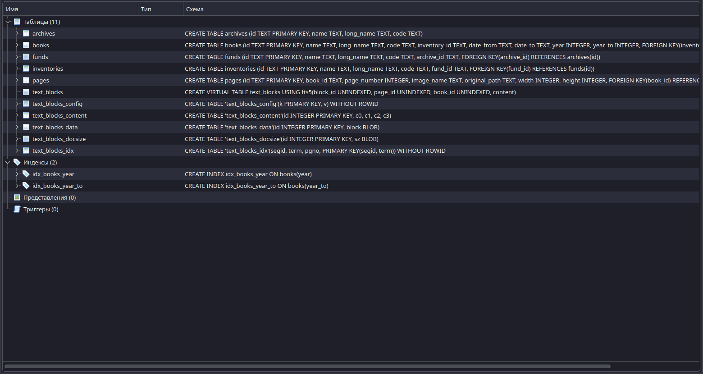
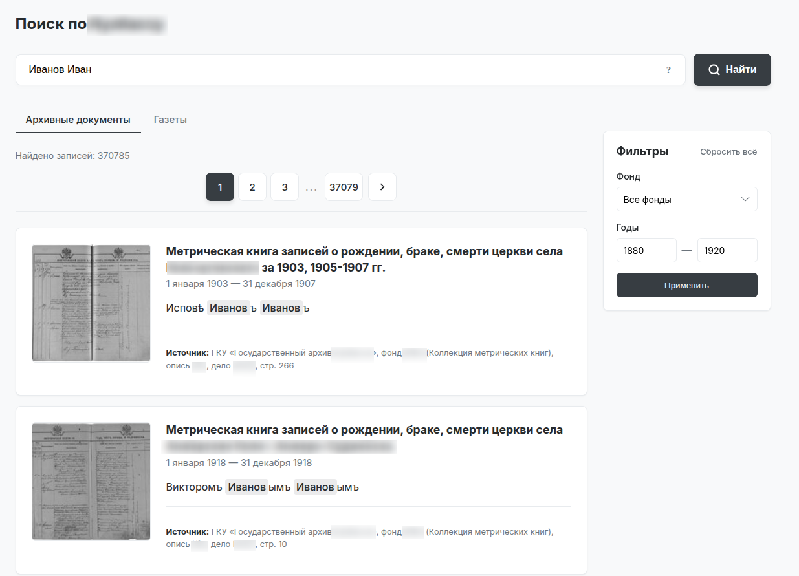
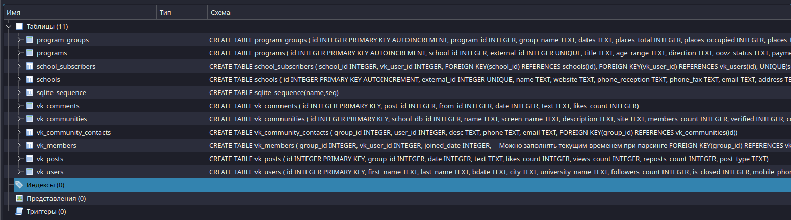
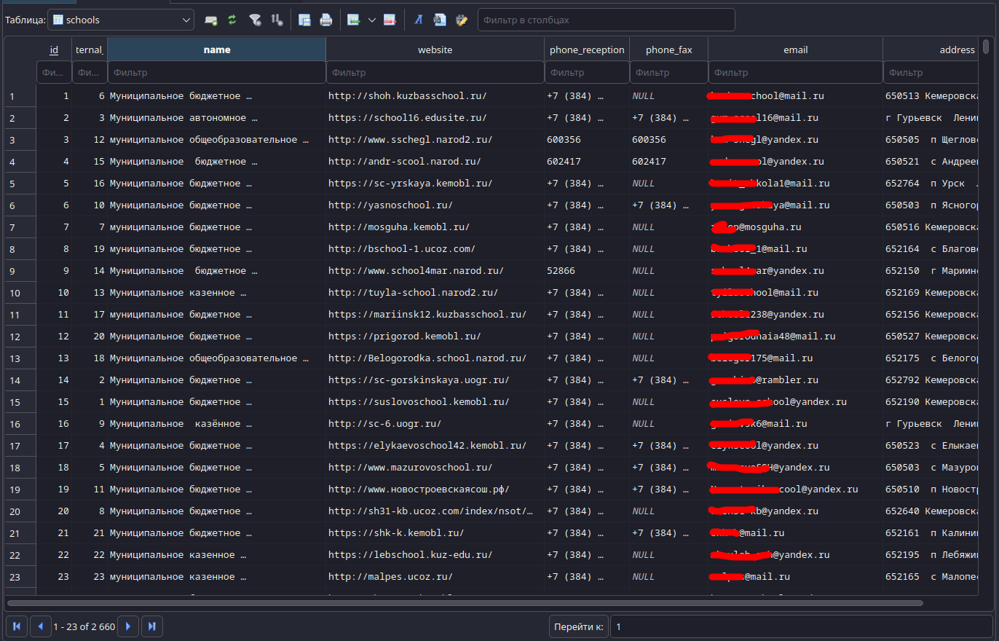
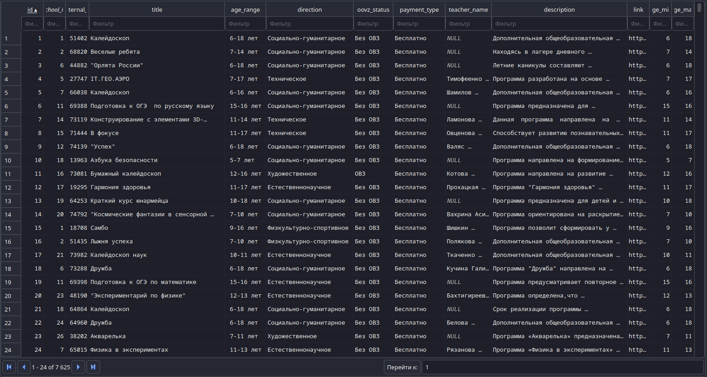

# Python Developer — Data & Automation

Привет. Я занимаюсь разработкой на Python, в основном всякими штуками
с данными, автоматизацией, парсингом и базами данных.

Чаще всего работаю с Python, SQLite, API и вебом. Люблю задачи, где
нужно собрать много разрозненных данных, привести их в нормальный вид
и сделать из этого что-то удобное для поиска или дальнейшей работы.

Ниже несколько проектов, которые могу показать.

---

## Архивная база и поиск по историческим документам

Один из моих основных проектов — база с архивными документами и
OCR-расшифровками.

В общей сложности получилось около **4 ГБ чистого текста** с
материалами примерно за **1850–1920 годы**.

Данные были собраны, обработаны и разложены по структуре архива:

`архив → фонды → описи → книги → страницы → текстовые блоки`

Для поиска по тексту используется **SQLite FTS5**.

### Что здесь делал

- собирал и объединял большие объёмы текста;
- обрабатывал OCR-расшифровки;
- приводил данные к единой структуре;
- организовывал хранение документов и страниц;
- сделал полнотекстовый поиск по большому объёму текста;
- отдельно сделал небольшой веб-интерфейс для поиска по базе.

### Структура базы

### Поиск по архиву

---

## База школ и образовательных данных

Ещё один большой проект — база образовательных учреждений,
собранная из нескольких источников.

В ней есть информация о школах, образовательных программах,
программах дополнительного образования, а также связанные данные
из VK.

### Сейчас в базе

- **2 660 школ**
- **7 625 образовательных программ**
- **33 676 групп программ**
- **350 000+ пользователей VK** обработано
- примерно **70% школ сопоставлены с VK-сообществами**

Данные связаны между собой через отдельные таблицы, а не лежат
одной большой выгрузкой.

### Структура базы

### Данные школ

### Образовательные программы

---

## Парсинг и работа с VK

Также делал свои инструменты для сбора и обработки данных из VK.

В одном из проектов сделал веб-панель, через которую можно было
быстрее искать и просматривать собранные данные, потому что
стандартного поиска VK для некоторых задач было недостаточно.

Работал с:

- парсингом сообществ;
- пользователями и участниками;
- постами и комментариями;
- обработкой и хранением собранных данных;
- автоматизацией повторяющихся операций.

Саму панель здесь пока не выкладываю.

---

## Reverse engineering и автоматизация

Периодически занимаюсь и более нестандартными задачами.

Например, исследовал сторонние VPN-приложения, разбирался в том,
как они получают и хранят конфигурационные данные, и автоматизировал
обработку полученной информации.

В таких задачах обычно использую Python, анализ HTTP/API,
автоматизацию и reverse engineering.

---

## Что ещё могу делать

Помимо больших data-задач, могу спокойно сделать и более обычные
вещи:

- Python-скрипты и автоматизацию;
- парсеры;
- работу с API;
- SQLite и другие небольшие базы данных;
- обработку и очистку данных;
- небольшие веб-приложения и сайты;
- простые веб-панели для внутренних инструментов;
- Telegram-ботов как вспомогательные инструменты;
- интеграции между разными сервисами.

Сайты и боты — не основной мой профиль. В первую очередь мне интересны
Python, автоматизация, данные и всякие задачи, где нужно что-то
собрать, обработать или автоматизировать.

---

## Стек

`Python` · `SQLite` · `FTS5` · `API` · `Web Scraping` · `Data Processing`

Также использую различные библиотеки и инструменты в зависимости
от конкретной задачи.

---

Исходный код некоторых проектов закрыт, поэтому здесь в основном
показываю результаты и структуру готовых решений.
